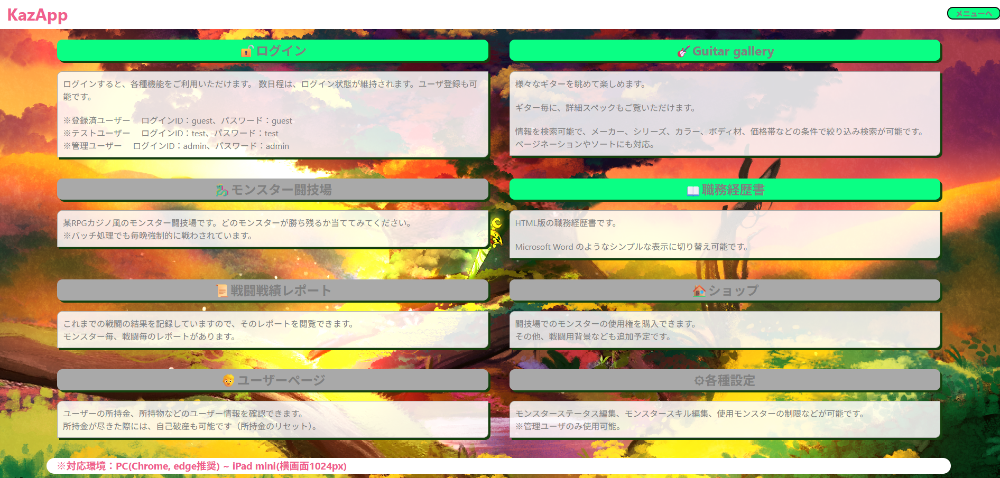
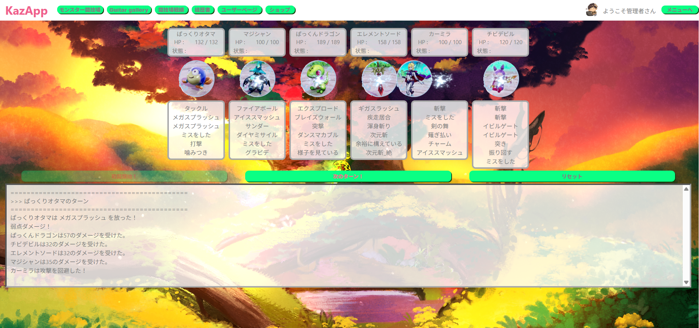
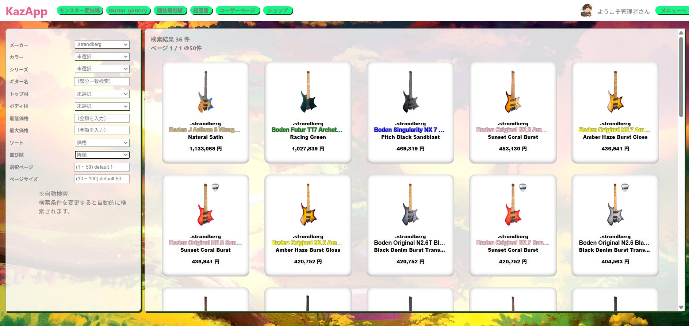
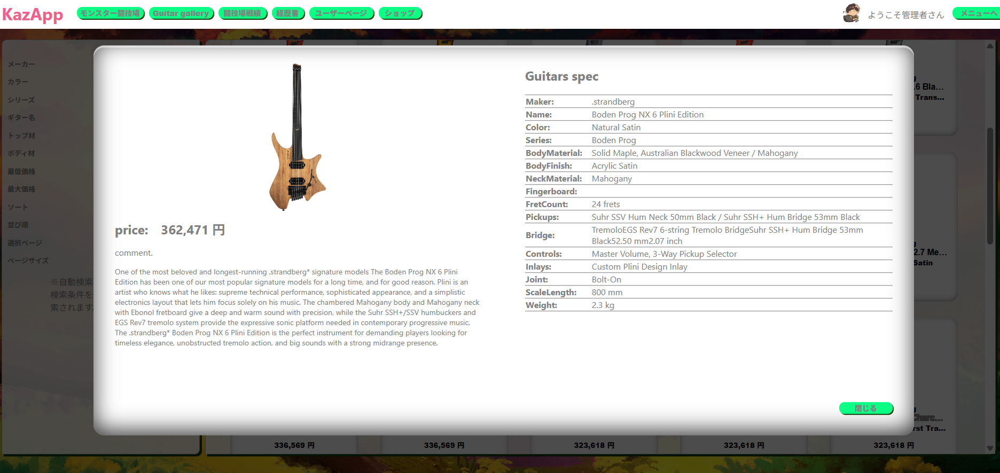
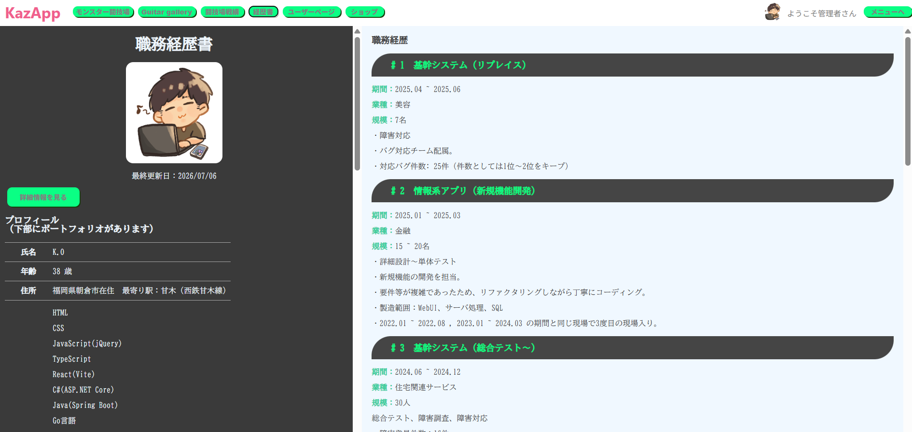
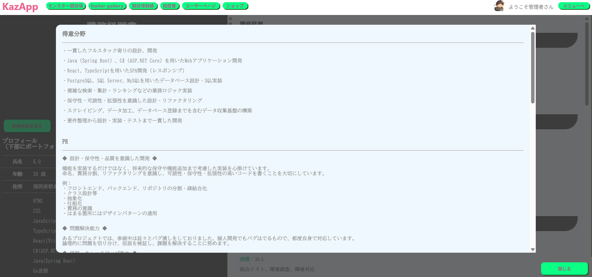
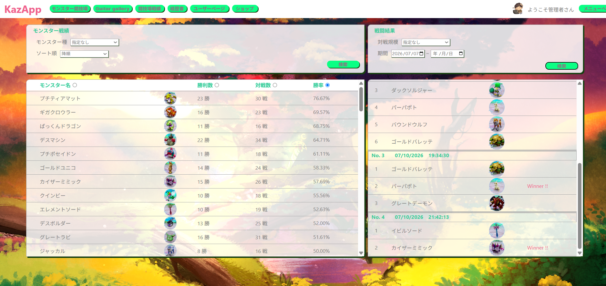

# Main Projects（ポートフォリオ）

- Guitar Gallery
- Guitar REST API(GET only)
- Monster Battle Arena
- web版経歴書

## Demo screenshots

---

<body style="text-align: center; width: 80%; margin: auto;">
    

        

            
メニュー画面

            
        

        

            
モンスターバトル

            
        

    

    

        

            
ギターギャラリー

            
        

        

            
ギター詳細

            
        

    

    

        

            
職務経歴書

            
        

        

            
PR欄

            
        

    

    

        

            
バトル履歴

            
        

        

            
アーキテクチャ図

            
        

    

</body>

---

システム全体を設計・実装を個人で実施。
本プロジェクトは、単一のアプリケーションではなく、
複数のWebサービス製作し、一つのプラットフォームへ統合していくことを目的としています。

## -- Guitar Gallery --

メーカー公式サイトから収集したギターデータを検索・閲覧できるWebアプリです。

スクレイピングによるデータ収集、テーブル設計、REST API、フロントエンドまで
一貫して設計・実装しました。

## Features

- 約4,400本のギターデータを検索
- メーカー・シリーズ・カラー・ボディ材など複数条件検索
- 部分一致検索
- ソート
- ページネーション
- 詳細モーダル表示
- 検索条件変更時に自動検索

---

## Technology Stack

Go + chromedp + colly
ASP.NET Core 8 + Dapper + REST API
React + TypeScript + Vite + styled-components
PostgreSQL
docker compose

client, api, repositoryを分割、疎結合化し、
client, repository は差し替えてもapiに及ぼす影響は少ない想定です。

---

## Why I Built This

製作理由は、プログラミングが楽しいからです。

次点として、
私はギターが好きで、メーカー公式サイトを眺めることがよくあります。

しかしメーカーごとに検索方法や情報の見せ方が異なるため、
「メーカーを横断して比較できる検索サイトが欲しい」
と思い、このアプリを制作しました。

単なる検索アプリではなく、

- クローラー設計
- API設計
- DB設計
- UI設計

まで一貫して設計し、実装しています。

開発中は、新しい技術を理解して実装していく過程そのものをゲームを攻略するように楽しみながら進めました。

---

## Design

### スクレイパー

メーカーごとの差分だけ実装すれば対応できるよう、
スクレイピング処理を抽象化しています。

例

- scraper_guitar_fender.go
- scraper_guitar_gibson.go
- ...

共通処理は抽象フレーム処理側へ集約しています。

メーカーごとに異なる商品ページ構造へ対応するため、
静的HTML取得(colly)とブラウザ操作(chromedp)を使い分けています。

また、取得したデータは共通モデルへ正規化し、
検索可能な形式でDBへ保存しています。

---

### API

検索条件はDTOへ集約し、
ページネーション・ソート・ページ内表示数に対応しています。

フロントエンドはAPIを意識せず利用できる構成を目指しました。

---

## -- Monster Battle Arena --

ブラウザで遊べるオートバトルゲーム。

「バトル〇んぴつ」と「モン〇ター闘技場」のゲーム性を参考に、
ランダム生成されるモンスターたちの勝者を予想するゲームです。

バトルロジックはすべてC#側で実装し、
Reactはバトル結果の描画に専念する責務分離の構成としています。
react > vue と切り替えても、C#側は修正不要です。

◆ゲームの特徴

- 最大6体参加のオートバトル
- 約80種類のモンスターから自動で選出
- 各モンスターは、約70種の行動スキルのうち6つを所持
- モンスターごとに異なるステータス・耐性・行動速度
- モンスターごとに個性が出ている
- 6種類の行動テーブルからランダム行動
- 状態異常・回復・属性攻撃
- 掛け金配当倍率システム（登場モンスターの数、組み合わせで変動）
- バッチで毎日勝手に戦っている（戦績、結果は保存）

◆管理画面

- ユーザーページあり
- 各モンスターのステータス・スキル構成の編集が可能（リセットも可能）
- 各モンスターの戦績、試合結果を記録しており、画面から確認可能

◆買い物

- ゲーム内通貨でアイテムの購入が可能。

# Guitar data API （説明書）

ギター情報を検索・取得するためのREST APIです。

メーカー、シリーズ、カラー、ボディ材、価格帯などの条件で絞り込み検索ができます。
ページネーションやソートにも対応しています。

特徴 -+-+-+-+-+-+-+-+-+-+-+-+-+-+-+-+-+-+

メーカー・シリーズ・カラーなど複数条件検索
部分一致検索（name / series）
価格帯検索
ソート機能
ページネーション対応
総件数取得
検索条件なしでも一覧取得可能

エンドポイント -+-+-+-+-+-+-+-+-+-+-+-+-+-+-+-+-+-+

GET /public/v1/guitars

クエリパラメータ -+-+-+-+-+-+-+-+-+-+-+-+-+-+-+-+-+-+

Parameter,Type,Description

- makerCd, int ,メーカーコード
- name, string, ギター名（部分一致検索）
- series, string, シリーズ名（部分一致検索）
- colorCd, int, カラーコード
- bodyMaterialTopCd, int, ボディトップ材
- bodyMaterialBackCd, int, ボディバック材
- minPrice, int, 最低価格
- maxPrice, int, 最高価格
- sort, string, maker or name or price
- order, string, ASC or DESC
- page, int, ページ番号
- pageSize, int, 1ページの件数

使用例 -+-+-+-+-+-+-+-+-+-+-+-+-+-+-+-+-+-+

GET /public/v1/guitars?makerCd=1&series=Strat&page=1&pageSize=25

レスポンス例 -+-+-+-+-+-+-+-+-+-+-+-+-+-+-+-+-+-+

{
  "totalCount": 283,
  "page": 1,
  "pageSize": 25,
  "totalPages": 12,
  "hasPrev": false,
  "hasNext": true,
  "guitars": [
    {
      "maker": "Fender",
      "name": "American Professional II Stratocaster",
      ...
    },
    {
        ...
    },
  ]
}

検索仕様 -+-+-+-+-+-+-+-+-+-+-+-+-+-+-+-+-+-+

name, series は部分一致検索を行います。
検索条件を指定しない場合は、全件取得します。

存在しないページを指定した場合はエラーではなく、空のギター配列を返します。
