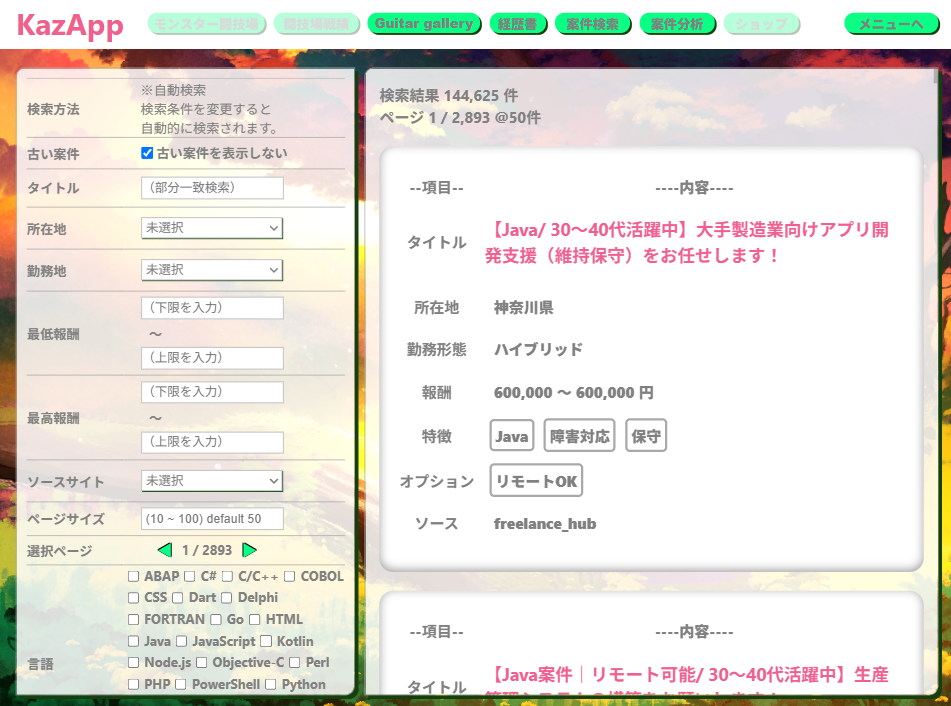
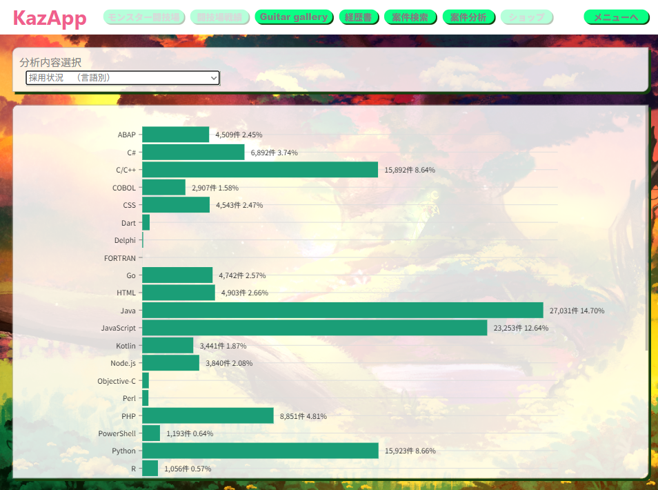

# Projects（ポートフォリオ）

- IT案件の検索・分析
- Monster Battle Arena
- Guitar Gallery
- Guitar REST API(GET only)
- web版経歴書
- API・batch監視システム(異常時にプッシュ通知)
- etc...

《 システム構成要素 》

React(Vite + HTML + CSS + TypeScript), C#(ASP.NET Core Web API), Go言語, PostgreSQL, REST API, Webスクレイピング, バッチ処理, Docker Compose, Nginx(リバースプロキシ), HTTPS(Let's Encrypt), レンタルVPS, GitHub Actions(CI/CD・自動デプロイ), ログ管理, 共通エラーハンドリング基盤, API・バッチ監視(異常検知, Discord通知), システム運用基盤(自動デプロイエラー、他各種エラー検知等)

## Demo スクリーンショット

---

<div style="text-align: center; width: 100%;">
    <div>
        
        
    </div>
    <div>
        
        
    </div>
    <div>
        
        
    </div>
    <div>
        
        
    </div>
    <div>
        
        
    </div>
</div>

---

## 技術スタック

Frontend
- React(HTML + CSS + TypeScript) + Vite + styled-components + Nivo

Backend:
- C#(ASP.NET Web API) + Dapper + REST API
- cron batch(C#, Go)

Data Collection:
- Go + chromedp + colly + sqlx

Database:
- PostgreSQL

Infrastructure:
- docker compose + Linux(Ubuntu) + VPS

Other:
- デザインパターン
- レイヤードアーキテクチャ

client, api, repositoryを分割、疎結合化し、
client, repository は差し替えてもapiに及ぼす影響は少ない想定です。

要件整理から基本設計・DB設計・アーキテクチャ設計・実装・テスト・運用・改善まで一貫して担当。

本プロジェクトは、単一のアプリケーションではなく、
複数のWebサービス製作し、一つのプラットフォームへ統合していくことを目的としています。

---

# Portfolioで取り組んだこと

このポートフォリオでは、単純なCRUDアプリケーションの作成だけではなく、実際に利用するデータを自分で収集するところから始めています。

特にIT案件サービスでは、

- 大量のデータ収集
- データの正規化
- PostgreSQLへの蓄積
- 検索条件を考慮したDB設計
- ASP.NET CoreによるAPI開発
- React / TypeScriptによるUI開発
- データの集計・分析
- クローラー・バッチの運用
- VPSへのデプロイ

までを一貫して実装しています。

---
## -- IT案件検索 --

IT案件情報を収集・蓄積し、案件の検索と市場分析を行えるWebサービスです。

現在、基本となる案件データは20万件以上、比較的新しい案件や終了案件を含むデータでは約14万件を保持しています。
また、案件に紐づく技術・条件等のfeatureデータは100万件以上を蓄積しています。

案件検索:

複数の条件を組み合わせて案件を検索できます。

- プログラミング言語
- フレームワーク・ライブラリ
- データベース
- クラウド
- インフラ
- 職能
- 勤務地
- 勤務形態
- 給与
- その他案件条件

検索結果は案件カードとして表示し、カードから掲載元サイトへ遷移して案件の詳細を確認できます。

---

## -- IT案件分析 --

蓄積した案件データを集計し、複数の観点から市場傾向を分析できます。

これにより、例えば「どの技術が案件で多く採用されているか」「技術ごとの給与水準にどのような傾向があるか」「地域によって勤務形態にどのような違いがあるか」といった情報を可視化（グラフ表示）できます。

勤務形態:

- 都道府県別の勤務形態

採用状況:

- 言語別
- フレームワーク・ライブラリ別
- 職能別
- インフラ別
- データベース別
- クラウド別

給与レンジ:

- 言語別
- フレームワーク・ライブラリ別
- 職能別
- インフラ別
- データベース別
- クラウド別

---

## -- Guitar Gallery --

複数のメーカー公式サイトから収集したギターデータを検索・閲覧できるWebアプリです。

スクレイピングによるデータ収集、テーブル設計、REST API、フロントエンドまで
一貫して設計・実装しました。

ギターのスペック情報を収集・正規化し、メーカーごとの情報形式の違いを吸収して統一したデータとして扱えるようにしています。

- 約4,400本のギターデータを検索可能（自動収集したデータ）
- メーカー・シリーズ・カラー・ボディ材など複数条件検索
- 部分一致検索
- ソート
- ページネーション
- 詳細モーダル表示
- 自動検索(検索条件変更時)

対応メーカー：

- Ibanez
- Fender
- PRS
- ESP
- Gibson
- Strandberg
- MusicMan
- Schecter
- Momose

---

## -- Monster Battle Arena --

ブラウザで遊べるオートバトルゲーム。

某ゲームの「バトル〇んぴつ」と「モン〇ター闘技場」のゲーム性を参考に、
ランダム生成されるモンスターたちの勝者を予想するゲームです。

バトルロジックはすべてC#側で実装し、
Reactはバトル結果の描画に専念する責務分離の構成としています。
react > vue と切り替えても、C#側は修正不要です。

◆ゲームの特徴

- 最大6体参加のオートバトル
- 約80種類のモンスターから自動で選出
- 各モンスターは、約70種の行動スキルのうち6つを所持
- モンスターごとに異なるステータス・耐性・行動速度
- モンスターごとに個性が出ている
- 6種類の行動テーブルからランダム行動
- 状態異常・回復・属性攻撃
- 掛け金配当倍率システム（登場モンスターの数、組み合わせで変動）
- バッチで毎日勝手に戦っている（戦績、結果は保存）

◆管理画面

- ユーザーページあり
- 各モンスターのステータス・スキル構成の編集が可能（リセットも可能）
- 各モンスターの戦績、試合結果を記録しており、画面から確認可能

◆買い物

- ゲーム内通貨でアイテムの購入が可能。

---

# バッチ・運用

Webアプリケーションだけでなく、継続的なデータ収集・運用を想定したバッチ処理も実装しています。

- 各種データ収集
- DBバックアップ
- 定期実行
- バッチ実行状況の管理
- エラー・障害対応

Docker Composeを利用して各コンポーネントを管理し、VPS上へデプロイしています。

---

## 開発・設計で意識したこと

各種データ収集から表示までを一貫して設計

案件情報を取得するだけではなく、

```
収集
 ↓
正規化
 ↓
DB保存
 ↓
API
 ↓
検索
 ↓
集計・分析
 ↓
画面表示
```

までを一つのサービスとして構築しています。

### 検索を前提としたデータ設計

案件本体の情報と、案件に紐づく技術・条件などのfeature情報を分離して管理しています。
大量の案件データを扱うことを前提として、検索条件やデータ量を考慮しながらSQL・インデックス・テーブル構成を設計しています。

### 大量データを扱うクローラー

求人、ギターサイトによってページ構成や取得方法が異なるため、静的ページにはHTTPベースの取得、動的ページにはブラウザを利用した取得を使い分けています。
また、アクセス制限などを考慮してクロール間隔を調整しながら、大量のURLを継続的に処理できるようにしています。

### APIとフロントエンド

ASP.NET Core Web APIをバックエンドとして、React / TypeScriptからAPIを利用する構成にしています。
検索・分析処理をAPI側へ集約することで、データ取得・集計処理と画面表示の責務を分離しています。

---

## 設計

### スクレイパー

メーカーごとの差分だけ実装すれば対応できるよう、
スクレイピング処理を抽象化しています。

例

- scraper_guitar_fender.go
- scraper_guitar_gibson.go
- ...

共通処理は抽象フレーム処理側へ集約しています。

メーカーごとに異なる商品ページ構造へ対応するため、
静的HTML取得(colly)とブラウザ操作(chromedp)を使い分けています。

また、取得したデータは共通モデルへ正規化し、
検索可能な形式でDBへ保存しています。

---

### API

検索条件、結果はDTOへ集約し、レスポンスは全てJSON形式に統一。
ページネーション・ソート・ページ内表示数に対応しています。

フロントエンドはAPIを意識せず利用できる構成を目指しました。

---

# Guitar data API （説明書）

ギター情報を検索・取得するためのREST APIです。

メーカー、シリーズ、カラー、ボディ材、価格帯などの条件で絞り込み検索ができます。
ページネーションやソートにも対応しています。

特徴 -+-+-+-+-+-+-+-+-+-+-+-+-+-+-+-+-+-+

メーカー・シリーズ・カラーなど複数条件検索
部分一致検索（name / series）
価格帯検索
ソート機能
ページネーション対応
総件数取得
検索条件なしでも一覧取得可能

エンドポイント -+-+-+-+-+-+-+-+-+-+-+-+-+-+-+-+-+-+

GET /public/v1/guitars

クエリパラメータ -+-+-+-+-+-+-+-+-+-+-+-+-+-+-+-+-+-+

Parameter,Type,Description

- makerCd, int ,メーカーコード
- name, string, ギター名（部分一致検索）
- series, string, シリーズ名（部分一致検索）
- colorCd, int, カラーコード
- bodyMaterialTopCd, int, ボディトップ材
- bodyMaterialBackCd, int, ボディバック材
- minPrice, int, 最低価格
- maxPrice, int, 最高価格
- sort, string, maker or name or price
- order, string, ASC or DESC
- page, int, ページ番号
- pageSize, int, 1ページの件数

使用例 -+-+-+-+-+-+-+-+-+-+-+-+-+-+-+-+-+-+

GET /public/v1/guitars?makerCd=1&series=Strat&page=1&pageSize=25

レスポンス例 -+-+-+-+-+-+-+-+-+-+-+-+-+-+-+-+-+-+

```json
{
  "totalCount": 283,
  "page": 1,
  "pageSize": 25,
  "totalPages": 12,
  "hasPrev": false,
  "hasNext": true,
  "guitars": [
    {
      "maker": "Fender",
      "name": "American Professional II Stratocaster",
      ...
    },
    {
        ...
    },
  ]
}
```

検索仕様 -+-+-+-+-+-+-+-+-+-+-+-+-+-+-+-+-+-+

name, series は部分一致検索を行います。
検索条件を指定しない場合は、全件取得します。

存在しないページを指定した場合はエラーではなく、空のギター配列を返します。
